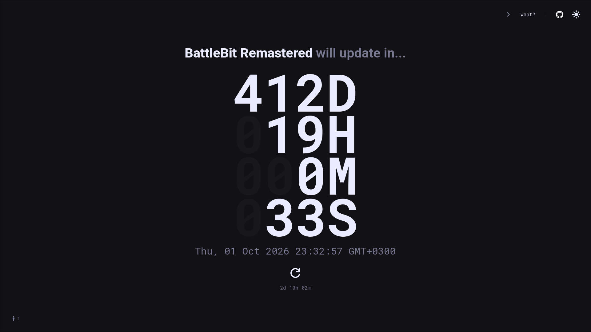

# update-countdown


<div align="center">
    <a href="https://updatecountdown.com">updatecountdown.com</a>
</div>

## What?
This website is a complicated and not-so-funny joke about how the game,
[BattleBit Remastered][battlebit], has not been updated in over a year and a
half despite promises. More info about this be found at
https://updatecountdown.com/battlebit#info.

<!-- ## Contents -->
<!-- - [Building](#building) -->
<!--   - [Requirements](#requirements) -->
<!--   - [Linux](#linux) -->
<!--     - [NixOS](#nixos) -->
<!--   - [Windows](#windows) -->
<!-- - [Running](#running) -->
<!-- - [Todo](#todo) -->
<!-- - [Tech stack](#tech-stack) -->

## Building
### Requirements
- [cargo](https://github.com/rust-lang/cargo) - Rust package manager
- [esbuild](https://esbuild.github.io/) - an extremely fast bundler for the web
- [minify](https://github.com/tdewolff/minify) - Go minifiers for web formats
- [TimeScaleDB](https://github.com/timescale/timescaledb) - time-series database packaged as a Postgres extension
- [upx](https://github.com/upx/upx) (optional) - executable file compressor

### Linux
With upx (compresses binary size):
```bash
sh build.sh
```
Or, without upx:
```bash
RUSTFLAGS="-C target-cpu=native" cargo build --release
```

#### NixOS
```bash
nix develop .#build -c $SHELL
sh build.sh
```

### Windows
```
cargo build --release
```

## Setup / Running

1. Have a PostgreSQL server running with TimeScaleDB installed. Either
   [self-hosted][timescale-installation] or using [TigerData][tigerdata].

2. To set the connection parameters, you can set the [PostgreSQL environment
   variables][sqlx-env-vars] as needed. (e.g. `PGHOST`, `PGPORT`, `PGDATABASE`,
   `PGUSER`, `PGPASSWORD`)

3. Copy the `save-EXAMPLE.json` file to create a `save.json` file and modify
   the _datetime_ as you like. Note that multiple entries/pages is not yet
   supported.

4. [Build](#building) the project and run the binary:
```
./target/release/update-countdown
```

## Todo
- Make collecting time series data optional (i.e. place behind a feature flag)
- Add Docker/Containerization support
- Add other game pages (e.g. Battlefront II, Silksong, Half-Life 3)
- Add home & statistics page
- Config file to change settings (e.g. port, DB URL)
- Save page state to DB (overkill maybe?)

## Tech stack
- __Frontend__: HTML + [Askama](https://github.com/askama-rs/askama), CSS, JS
  (with [JSDoc][jsdoc])
- __Bundler__: [esbuild], [minify]
- __Backend__: [axum]
- __Database__: [PostgreSQL][postgres] with [TimeScaleDB][timescale] (for
  collecting time series data)

__Motivation__: Simple, fast, memory efficient, few dependencies


[askama]: https://github.com/askama-rs/askama
[axum]: https://github.com/tokio-rs/axum
[battlebit]: https://store.steampowered.com/app/671860/BattleBit_Remastered/
[cargo]: https://github.com/rust-lang/cargo
[esbuild]: https://esbuild.github.io/
[jsdoc]: https://jsdoc.app/
[minify]: https://github.com/tdewolff/minify
[postgres]: https://www.postgresql.org/
[sqlx-env-vars]: https://docs.rs/sqlx/latest/sqlx/postgres/struct.PgConnectOptions.html#parameters
[tigerdata]: https://www.tigerdata.com/
[timescale-installation]: https://docs.tigerdata.com/self-hosted/latest/install/
[timescale]: https://github.com/timescale/timescaledb
